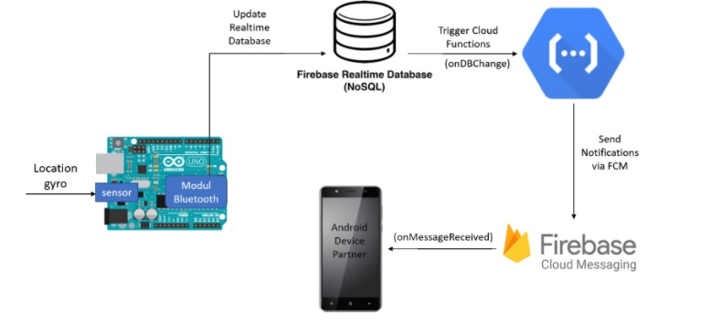

# Verti-Go!

> Tujuan dari aplikasi ini adalah membantu penderita ketika mengalami vertigo atau keadaan darurat di tempat umum dan membutuhkan penanganan segera. Selain itu aplikasi juga dapat mengirimkan reminder bagi penderita untuk melakukan exercise mandiri karena dengan exercise yang rutin, gejala-gejala vertigo dapat sedikit demi sedikit berkurang.

> Arsitektur Sistem

> Anggota
1. Candra Hesen Parera - 13515019
2. Royyan Abdullah Dzakiy - 13515123
3. Annisa Nurul Azhar - 13515129